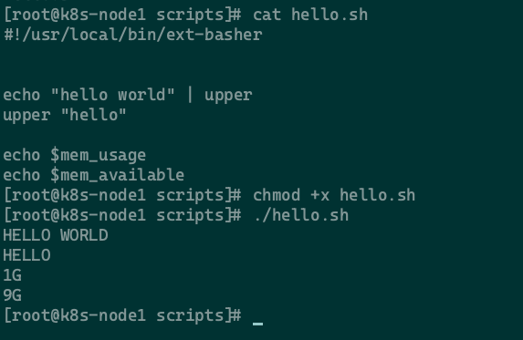

# ext-basher

bash语法扩展工具，支持扩展变量、命令，仅支持X86架构

# 如何使用

## 构建
`git clone https://github.com/rtmzk/ext-basher`

```shell
shell> cd ext-basher
shell> go build -o ext-basher
```

## 测试脚本
测试脚本可参考`scripts/hello.sh`

替换脚本解释器`#!/bin/bash`为`#!/path/to/your/ext-basher`

执行脚本
`./hello.sh`




# 如何扩展功能

## 扩展变量

在`pkg/func`中新建go文件

```go
package func

var showSomething = new(Func).builder("showSomething", ExportVariables).setVariables("show something!").build
```

`setVariables`的值只能是字符串

在`pkg/func/root.go`中添加该变量

```go
func init() {
  Functions.
	  addCommand(*upperFunction).
	  addCommand(*lowerFunction).
	  addCommand(*memoryAvailable).
	  addCommand(*memoryUsage).
	  addCommand(*showSomething)
}
```

## 扩展命令

在`pkg/func`中新建go文件

```go
package func

func do(args []string) {
  // do function body
}

var doSomething = new(Func).builder("doSomething",ExportFunction).setCmd(do).build
```

`setCmd`的传参要符合函数签名 `func(args []string)` ,可以使用装饰器

在pkg/func/root.go中添加该变量

```go
func init() {
  Functions.
	  addCommand(*upperFunction).
	  addCommand(*lowerFunction).
	  addCommand(*memoryAvailable).
	  addCommand(*memoryUsage).
	  addCommand(*showSomething).
	  addCommand(*doSomething)
}
```


# 目前已扩展的功能 

| 名称          | 类型 | 说明           |
| ------------- | ---- | -------------- |
| upper         | 命令 | 字符串转为大写 |
| lower         | 命令 | 字符串转为小写 |
| mem_usage     | 变量 | 内存使用量     |
| mem_available | 变量 | 内存剩余量     |
